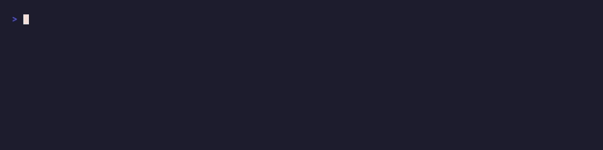

# City Feedback | Projektteam 5


📘 [Java-Documentation ansehen](https://team05-se.github.io/CityFeedback/)

📘 Die Dokumentationen zu den einzelnen Übungen befinden sich im Verzeichnis [/docs](https://github.com/Team05-SE/CityFeedback/tree/main/docs)

## Voraussetzungen

* Java 25+ (für Backend)
* Maven 3.8+ (für Backend-Build)
* [Bun](https://bun.sh/) installiert (für Frontend-Dev-Server)
* Git (für Versionskontrolle)

## Backend lokal starten


1. Ins Projektverzeichnis wechseln:

   ```bash
   cd CityFeedback
   ```
2. Backend bauen und Tests ausführen:

   ```bash
   ./mvnw clean install
   ./mvnw test
   ```
3. Backend starten (optional, falls der Server laufen soll):

   ```bash
   ./mvnw spring-boot:run
   ```

* Standardmäßig läuft das Backend auf `http://localhost:8080`

## Frontend lokal starten (Vite + React)



1. In den Frontend-Ordner wechseln:

   ```bash
   cd frontend
   ```
2. Abhängigkeiten installieren (nur beim ersten Mal oder nach Änderungen in `package.json`):

   ```bash
   bun install
   ```
3. Dev-Server starten:

   ```bash
   bun run dev
   ```
4. Browser öffnen: `http://localhost:5173`

* Hot Reload ist aktiv → Änderungen an React-Komponenten erscheinen sofort

## Hinweise

* **Backend und Frontend müssen nicht im gleichen Terminal laufen**, aber beide sollten gestartet sein, wenn lokal getestet werden soll.
* `.gitignore` enthält `target/` und `*.class`, damit Build-Artefakte nicht ins Git gelangen.
* Bun wird nur für das Frontend benötigt. Ohne Bun kannst der Dev-Server nicht starten.
* Die lokale Java-Version soll mindestens 25 sein und Maven 3.8+ verwendet werden, um das Projekt starten zu können.
